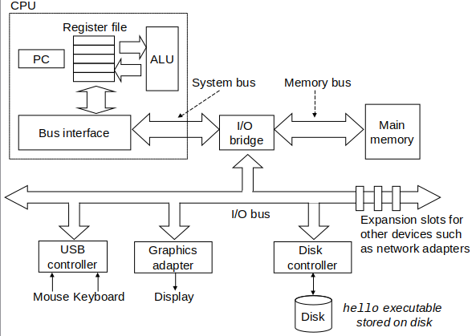
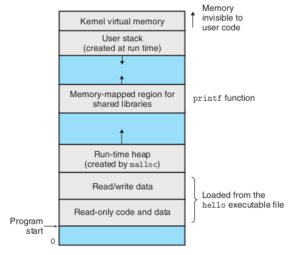

# 1 信息就是位+上下文
ASCII码允许用唯一的单字节大小(8个位)的整数值代表每个字符。这样我们编写的源程序(源文件)其实是只由ASCII字符构成的**文本文件**。所有其他文件称为**二进制文件**。

# 2 程序被其他程序翻译成不同的格式
```
gcc -o hello hello.c 
```
上述命令的具体过程如下：
- 预处理阶段。预处理器(cpp)处理源程序hello.c中以```#```开头的命令，如：```#include <iostream>```告诉预处理器读取该头文件的内容，并**直接插入到程序文本中**。这样通常得到了另一个文本文件：hello.i
- 编译阶段。编译器(ccl)将文本文件hello.i翻译成一个**包含汇编语言程序**的文本文件hello.s。汇编语言是一种介于高级语言和机器语言指令之间的低级语言。
- 汇编阶段。汇编器(as)将hello.s中的汇编语言翻译成**机器语言指令**，得到一个二进制文件hello.o
- 链接阶段。头文件中只包含函数的声明，当我们的源程序中包含其他文件中定义的函数时，链接器(ld)就会负责合并源程序的二进制文件hello.o和代表函数的二进制文件(如printf.o)。最终得到一个可执行文件hello，存储于磁盘中

# 4 处理器读并解释存储在存储器中的指令
想要在Unix系统上运行存储在磁盘中的可执行文件hello，就需要将其文件名输入到外壳(shell)中
```
./hello
```
shell是一个命令行解释器。如果命令行的第一个单词不是一个内置的shell命令，那么shell就会假设这是一个可执行文件的名字。它将加载并运行这个文件，该文件运行终止后shell会输出一个提示符，等待下一个输入的命令行

## 4.1 系统的硬件组成


1. 总线(I/O bus)。携带信息字节并负责在各个部件间传递。通常信息以**字**(定长的字节块,32位系统为4字节，64位系统为8字节)的形式在总线中传递
2. I/O设备(如：Mouse, Keyboard, Display, Disk)。每个设备都通过一个控制器(controller)或适配器(adapter)与I/O总线相连。控制器是位于设备本身或系统主板的芯片组，而适配器是一块插在主板插槽上的卡。磁盘用于长期存储数据和程序。
3. 主存(Main Memory)。临时存储设备，在处理器执行程序时，用来存放程序和程序处理的数据。主存是由一组动态随机存取存储器(DRAM)芯片组成的。
4. 处理器(CPU)。处理器的核心程序计数器(PC)是一个容量为1个字的存储设备(或寄存器)。PC在任何时刻都指向主存中的某条机器语言指令，即含有该条指令的地址。从系统通电开始，直到系统断电，处理器一致在不断执行PC指向的指令，再更新PC，使其指向下一条指令(并不一定与主存中刚刚执行的指令相邻)。
   
   而每条指令实际上可能要求CPU执行以下操作：
   - 加载：把一个字节或者一个字从主存(Main Memory)复制到寄存器(Register File)，以覆盖寄存器原来的内容。 
   - 存储：把一个字节或者一个字从寄存器赋值到主存的某个位置，以覆盖这个位置原来的内容
   - 操作：把两个寄存器中的内容复制到算术/逻辑单元(ALU)，ALU对两个字做算术操作，并将结果存放到一个寄存器中，以覆盖该寄存器中原来的内容
   - 跳转：从指令本身中抽取一个字，并将这个字复制到PC中，以指向下一条指令

## 4.2 运行hello程序
1. 键盘上输入```./hello```
2. shell将输入的字符逐一读入寄存器，再把它存放到主存中
3. shell加载可执行文件hello，并利用直接存储器存取技术(DMA)直接将hello目标文件的代码和数据从磁盘读入主存
4. CPU执行机器语言指令，将"Hello World\n"字符串中的字节从主存复制到寄存器文件，再从寄存器文件复制到显示设备，并最终显示在屏幕上

# 5 高速缓存至关重要
hello程序的运行需要经过多次信息的挪动:
- hello程序的机器指令最初存放在磁盘上；程序加载时，被复制到主存；CPU运行程序时，指令又从主存复制到处理器。
- "Hello World\n"字符串初始时在磁盘上，然后复制到主存上，最后从主存复制到显示设备。

但这些操作其实是减缓了真正工作的开销。较大的存储装备要比较小的存储设备运行得慢，但快速设备的造价远高于同类的低速设备。通常一个系统的存储设备的大小关系：磁盘 >> 主存 >> 寄存器。结果就是CPU从寄存器中读取数据的速度比从主存中读取区几乎快一百倍。针对这种差异，系统采用大小介于寄存器和主存之间的高速缓存存储器(硬件技术：静态随机访问存储器 SRAM)，以存放处理器近期可能会需要的信息。强力系统甚至存在三级高速缓存：L1,L2,L3

# 6 存储设备形成层次结构


从上至下，设备变得访问速度越来越慢，容量越来越大，每字节的造价越来越便宜。存储器的层次结构的主要思想是**上一层的存储器是下一层的高速缓存**。

# 7 操作系统管理硬件
操作系统是应用程序和硬件之间插入的一层软件：


操作系统的两个功能：
- 防止硬件被失控的应用程序滥用
- 向应用程序提供简单一致的机制来控制复杂而又通常大相径庭的低级硬件设备

操作系统中的几个抽象概念：


## 7.1 进程 Process
进程是操作系统对一个正在运行的程序的一种抽象。在一个系统上可以同时运行多个进程，而且每个进程都好像在独占地使用硬件。无论是单核还是多喝系统中，需要同时运行的进程数是多于可以运行他们的CPU个数的。一个CPU看上去可以并发地执行多个进程，原因是CPU可以在进程间切换。操作系统这种交错执行的机制称为**上下文切换(context switch)**。

以只包含一个CPU的单处理器系统为例：**在任何一个时刻，单处理器系统都只能执行一个进程的代码**。


示例场景中有两个进程：shell进程和hello进程。起初只有shell进程进行，当我们输入```./hello```后，系统调用会将控制权传递给操作系统。操作系统保存shell进程的上下文，创建一个新的hello进程及其上下文，然后将控制权传递给新的hello进程。hello进程终止后，操作系统恢复shell进程的上下文，并将控制权传回给它，等待下一个命令行的输入。

## 7.2 线程 Thread
一个进程实际上可以由多个称为**线程**的执行单元组成，每个线程都运行在进程的上下文中，并共享同样的代码和全局数据。进程的个体间是完全独立的，而线程间是彼此依存的。

## 7.3 虚拟存储器 Virtual memory
虚拟存储器是一个抽象概念，它为每个进程提供了一个假象，即每个进程都在独占地使用主存。每个进程看到的是一致的存储器，称为**虚拟地址空间**：



上图的地址从下往上是增大的。地址空间的底部区域存放用户进程定义的代码和数据。地址空间最上面的区域是为操作系统中的代码和数据保留的，这对所有进程是一致的。

我们从最低的地址，逐步向上介绍上面出现的区域名词:
1. 程序代码和数据(Loaded from the executable file)：对于所有进程来说，代码是从同一固定地址开始的，分别为0x08048000（32位）以及0x00400000（64位），紧接着是全局变量相对应的数据位置。
2. 堆(heap)：代码和数据区后紧随的是运行时堆(Run-rime heap)。代码和数据区是在进程一开始运行时就规定了大小，而当调用malloc和free这样的 C 标准库函数(类似C++中的allocator?)时，堆可以在运行时动态的扩展和收缩。
3. 共享库(Memory mapped region for shared libraries)存放像C标准库和数据库这样的代码和数据的区域。
4. 栈(Stack)：位于用户虚拟地址空间顶部，编译器用它来实现函数调用，用户栈(User stack)在程序执行期间可以动态的扩展和收缩。当我们调用一个函数时，栈会增长；从一个函数返回时，栈会收缩。
5. 内核虚拟存储器(Kernel virtual memory)：内核总是驻留在内存中，是操作系统的一部分，不允许应用程序读写这个区域的内容或者直接调用内核代码定义的函数。

## 7.4 文件
文件就是字节序列，即由值0和值1组成的序列。所有的I/O设备，包括磁盘、键盘、鼠标、显示器都可以看成是文件。

文件向应用程序提供了一个统一的视角来看待系统中所有的I/O设备。

# 8 系统之间利用网络通信


当系统将一串字节从主存复制到网络适配器时，数据流经过网络到达另一台机器。

# 9 重要主题
## 9.1 并发和并行
- 并发(cocurrency)：指一个同时具有多个活动的系统
- 并行(parallelism)：用并发使一个系统运行得更快

并行可在计算机系统的多个抽象层次上使用，我们按照系统层次结构中由高到低的顺序讲解：
1. 线程级并行：在一个进程中执行多个控制流。与单处理器系统相对，现代的多处理器系统有两种不同情况以实现线程级并行：多核或超线程
   - 多核(Multicore)：将多个CPU(也称核)集成到一个集成电路芯片上。每个核都有自己的L1和L2高速缓存，但是它们共享更高层次(L3,...)的高速缓存以及到主存的接口。
   - 超线程(hyperthreading)：允许一个CPU执行多个控制流的技术。例如，假设一个线程必须等到某些数据被装载到高速缓存中，那CPU就可以继续去执行另一个线程。
2. 指令级并行：现代处理器可以同时执行多条指令。依靠于流水线和超标量处理器。

   - 流水线(pipelining)：在流水线中，将执行一条指令所需要的活动划分为不同的步骤，将处理器的硬件组织成一系列的阶段，每个阶段执行一个步骤。 这些阶段可以并行的操作。 用来处理不同指令的不同部分。
   - 超标量(superscalar)处理器：可以达到比一个周期一条指令更快的执行速率的处理器
3. 单指令、多数据并行(SIMD parallelism)

## 9.2 计算机系统中抽象的重要性
指令集结构(Instruction set architecture)提供了对实际处理器硬件的抽象，虚拟机(Virtual machine)提供了对整个计算机(包括操作系统、处理器和程序)的抽象：

