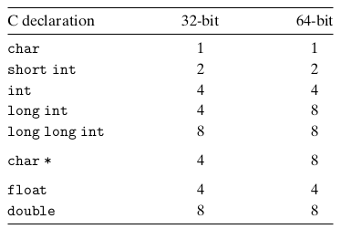
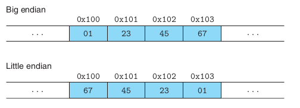
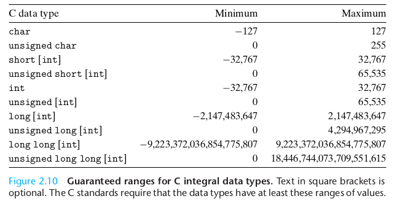
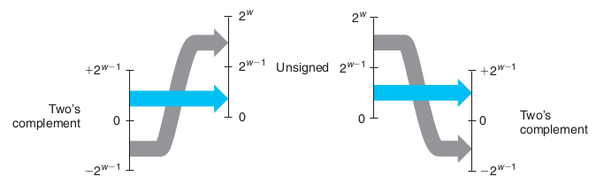
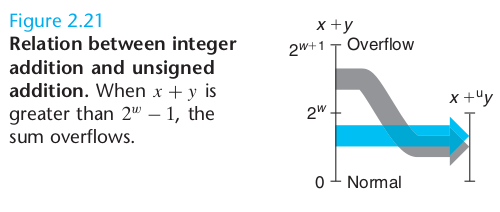
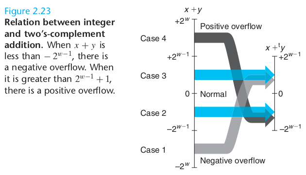
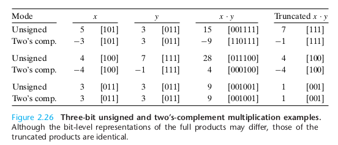
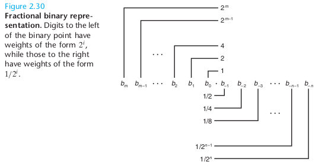

三种重要的数字表示：
- 无符号(unsigned):基于传统的二进制表示法，表示大于或等于0的数字
- 补码(two's-complement):表示有符号整数
- 浮点数(floating-point):表示实数的科学计数法的以二为基数的版本

整数的表示虽然只能编码一个较小的数值范围，但是这种表示是精确的；而浮点数虽然可以编码一个较大的数值范围，但是这种表示只是近似的：
```cpp
cout << 500*400*300*200 << endl;//溢出，输出负数，但交换顺序不改变结果
cout << (3.14 + 1e20) - 1e20 << endl;//输出0
cout << (1e20 - 1e20) + 3.14 << endl;//输出3.14
```
# 0 取模运算
$$a\ \text{mod}\ b = a-c*b,\ \text{with}\ c = \lfloor a/b\rfloor$$
# 1 信息存储
机器级程序将存储器视为一个非常大的字节(1byte = 8bit)数组，称为[虚拟存储器 virtal memory](./01_计算机系统漫游.md#73-虚拟存储器-virtual-memory)。存储器的每个字节都由一个唯一的数字来标记，称为它的**地址 address**。所有可能地址的集合称为**虚拟地址空间 virtual address space**。每个进程看到的虚拟地址空间都是统一的。
## 1.1 十六进制(hexadecimal)表示法
C语言中以0x或0X开头的数字常量被认为是十六进制的值。

每个十六进制位可以转化成4位二进制

## 1.2 字
每台计算机都有一个**字长 word size**，指明整数和指针数据的标称大小。每个虚拟地址对应的存储空间是一个字节，但虚拟地址是用一个字(word)来编码的。假设一个机器字长为w，则虚拟地址的范围是0~2^w-1。因此程序最多访问2^w个字节。

## 1.3 数据大小
32位系统及64位系统中，C语言中数字数据类型的字节数：


## 1.4 寻址和字节顺序
跨越多字节的程序对象被存储为连续的字节序列，而该对象的地址为所使用字节中最小的地址。假设一个类型为int的变量x的地址为0x100，表示地址表达式&x的值为0x100，x的4个字节被存储在0x100, 0x101, 0x102, 0x103。

两种存储多字节对象的方法：
- 小端法(little endian)：最低有效字节在最前面
- 大端法(big endian)：最高有效字节在最前面

以0x01234567为例：


## 1.5 表示字符串
文本数据使用某种标准编码以具有更强的平台独立性

- 生成一张ASCII表(使用单字节表示字符)：
    ```shell
    $ man ascii
    ```
- 文字编码的Unicode标准

    ASCII字符集适合于编码英语文档，汉语等语言的文档需要用Unicode编码，使用32位(4个字节)来表示字符

## 1.6 表示代码
二进制代码是不兼容的。同一个程序在不同系统的机器上编译生成的机器代码(二进制代码)是不兼容的。

## 1.8 C语言中的位级运算
```|```：按位或

```&```：按位与

```～```：按位取反

```^```：按位异或

掩码：如```x & 0xFF```生成一个由```x```的最低有效字节组成的值。如：```x = 0x89ABCDEF; x & 0xFF=0x000000EF```。而如果想要一个表示全1的掩码，一般直接用```~0```,以提高代码可移植性。

## 1.9 C语言中的逻辑运算
```||```：逻辑或

```&&```：逻辑与

```!```：逻辑非

## 1.10 C语言中的移位运算符
- 左移```<<```
  
    ```x<<k```表示x向左移动k位，丢弃最高的k位，并在最后补k个0
- 右移```>>```

    1. 逻辑右移：```x>>k```表示在x左端补k个0，并删除最后k位。即$[0,...0,x_{n-1},x_{n-2}...,x_k]$
    2. 算术右移：```x>>k```表示在左端补k个最高有效位的值，并删除最后k位。即$[x_{n-1},...,x_{n-1},x_{n-1},x_{n-2},...,x_k]$

C语言中：对于无符号数据，右移必须是逻辑的；而对于有符号数据，右移在几乎所有编译器中都定义为算术右移。

当移动的位数k较大时，实际上的位移量是k%w位(实际为类似取余运算的取模运算)，其中w代表机器的[字长](#12-字)

# 2 整数表示
## 2.1 整型数据类型
C语言中要求下列数据类型至少具有这样的取值范围：


## 2.2 无符号数的编码(Unsigned)
每个介于$UMin=0\sim UMax=2^w-1$之间的数都有唯一的w位的值编码

## 2.3 补码编码(Two's-complement)
$x =-x_{w-1}2^{w-1}+\sum_{i=0}^{w-2}x_i2^i$ ，如1111表示-8+4+2+1=-1

补码可表示的范围为$TMin=-2^{w-1}\sim TMax=2^{w-1}-1$。也就是说最小的负数$TMin$没有与之对应的正数。

$UMax=2TMax+1$假设两者所用的字长$w$相等

C语言中定义了INT_MAX, INT_MIN和UINT_MAX以描述当前机器不同整型数据类型的取值范围。(定义在limits.h头文件中)

几乎所有机器都会采用补码形式来表示有符号整数。但有符号数还有其他两种表示方法：
1. 反码(Ones‘ Complement):最高有效位的权是$-(2^{w-1}-1)$，而不是$-2^{w-1}$，其余和补码一致
2. 原码(Sign-Magnitude):最高有效位是符号位，用来确定剩下的位应该是取负权还是正权

但反码和原码都存在2种表示0的编码方式

## 2.4 有符号数和无符号数之间的转换
强制类型转换的结果保持位不变，只是改变了解释这些位的方式：
```cpp
short int s = -12345;
unsigned short us = static_cast<unsigned short>(s);
cout << s << " " <<  us << endl;//-12345 53191

unsigned ui = UINT_MAX;
int i = static_cast<int>(ui);
cout << i << " " << ui << endl;//-1 4294967295
```


## 2.6 扩展一个数字的位表示
在不同字长的整数之间转换，同时保持数值不变。
- 零扩展(zero extension)：将一个无符号数转换为一个更大的数据类型，只需要在开头处添加0
- 符号扩展(sign extension)：将一个补码数字转换为一个更大的数据类型，只需要在开头处重复最高有效位即可：$[x_{w-1},...,x_{w-1}, x_{w-1},x_{w-2},...,x_0]$。保证了值的不变。

## 2.7 截断数字
将一个w位的数截断为一个k位数字时，会直接丢弃高w-k位:
```cpp
int x = 53191;//0x0000cfc7
cout << x << " ";//53191
short sx = static_cast<short>(x);//0x0000cfc7
cout << sx << " ";//-12345
//从short向int的隐式转换
x = sx;//0xffffcfc7
cout << x << endl;//-12345
```
由int(4字节)转换成short(2字节)时由于前16位被舍弃，最高位变为1，故变为负数；但是在由short向int进行强制转换时，需要在开头处重复最高位(1)，故保证数值不变。

## 2.8 关于有符号数与无符号数的建议
从有符号数到无符号数的隐式强制类型转换会导致某些操作不太直观：
```cpp
unsigned i = 0;
//i-1为unsigned，即隐含了一个有符号数-1到无符号数UINT_MAX的转换
cout << i-1;//4294967295,即UINT_MAX
```

# 3 整数运算
## 3.1 无符号加法
假设x, y均为w位无符号数，则无符号加法可以定义为：
$$x+^u_wy=\left\{\begin{aligned}&x+y,\ &x+y<2^w\\&x+y-2^w,\ & 2^w\leq x+y<2^{w+1}\end{aligned}\right.$$



无符号整数的相反数(加法逆元)：
$$-^u_wx=\left\{\begin{aligned}&x,\ &x=0\\ &2^w-x,\ &x>0\end{aligned}\right.$$

## 3.2 补码加法



假设x, y均为w位无符号数，则无符号加法可以定义为：
$$x+^t_wy=\left\{\begin{aligned}&x+y+2^w,\ &-2^w\leq x+y<-2^{w-1}\\ &x+y,\ &-2^{w-1}\leq x+y<2^{w-1}\\ &x+y-2^w,\ &2^{w-1}\leq x+y<2^w\end{aligned}\right.$$

## 3.3 补码的非
补码的非可以理解为补码的加法逆元：

$$-^t_wx = \left\{\begin{aligned}&-2^{w-1},\ &x=-2^{w-1}\\ &-x,\ &x>-2^{w-1}\end{aligned}\right. $$
注：w位补码的取值范围：$-2^{w-1}\sim2^{w-1}-1$

## 3.4 无符号乘法
$$x*^u_wy=(x\cdot y)\ \text{mod}\ 2^w$$

## 3.5 补码乘法
$$x*^t_wy = U2T_w(x*^u_wy)$$
即对于无符号和补码乘法而言，乘法运算的位级表示是一样的，只是编码方式不同(注意无符号和补码的二进制表示)：


注： $w=3$

## 3.6 乘以常数
在大多数机器上整数乘法相当慢，需要10个或更多的时钟周期
- w位整数$x$和$2^k$相乘
  1. $x\cdot 2^k = [x_{w-1},...,x_0, 0,... 0]$即在原来$x$的位级表示后添加k个0
  2. $x*^u_w2^k = (x\cdot 2^k)\ \text{mod}\ 2^w=[x_{w-k-1},x_{w-k-2},...,x_0,0,..,0],\ k < w$相当于左移k位
- 用移位、加法、减法的组合以降低计算整数乘法的代价

    如$x*^u_w14 = (x<<3) + (x<<2)+(x<<1)=(x<<4)-(x<<1)$
    其中$14=2^3+2^2+2^1=2^4-2^1$

## 3.7 除以2的幂
整数除法总是舍入到0(4.6舍入到4，-5.6舍入到5)。我们认定
- 对一个无符号数执行[逻辑右移](#110-c语言中的移位运算符)k位的操作和除以$2^k$有一样的效果。
  $$x/^u2^k\Leftrightarrow x>>k$$
- 对一个补码数进行[算术右移](#110-c语言中的移位运算符)k位的操作和除以$2^k$**效果不完全一样**：对于负数除法，算术右移结果向下舍入，而不是除法要求的舍入到0。

    由于对于任意整数$x$和$y>0$来说存在：$\lceil{x/y\rceil}=\lfloor{(x+y-1)/y\rfloor}$。我们可以在进行算术右移前先将负数的$x$加上$2^k-1$，此时再计算就相当于舍入到0了：
    $x/^t2^k\Leftrightarrow$ ```(x<0 ? (x+(1<<k)-1) : x)>>k```

# 4 浮点数
## 4.1 二进制小数



但部分小数(如1/3,1/5)无法用二进制小数精确表示