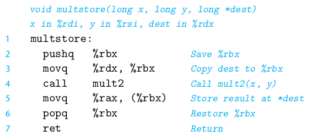
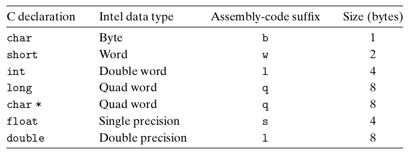
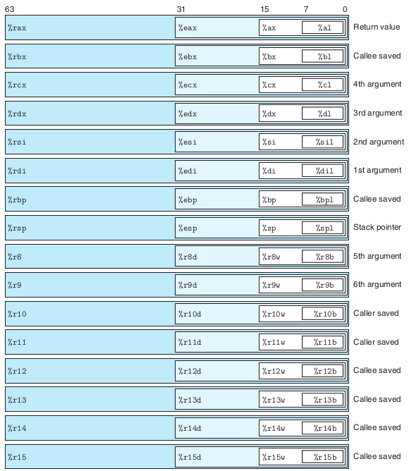
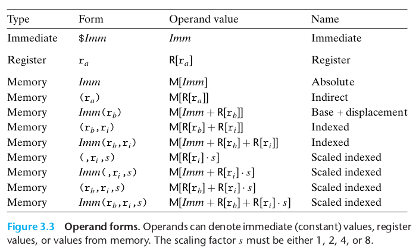
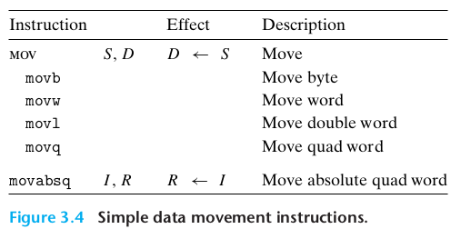
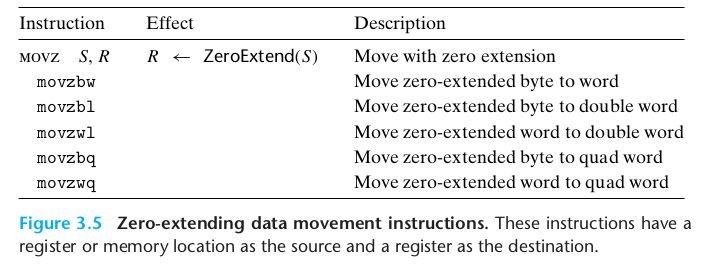
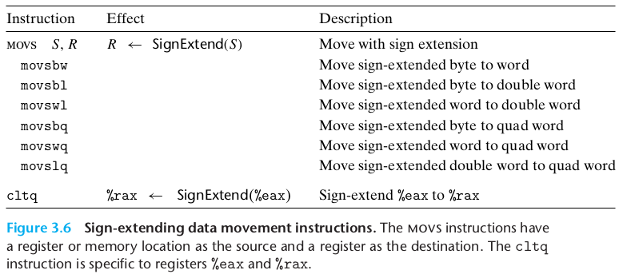

从[第一章](01_计算机系统漫游.md#2-程序被其他程序翻译成不同的格式)中，我们知道：编译器将预处理后的文本文件翻译成一个**包含汇编语言程序**的文本文件；然后再依次调用汇编器和链接器生成可执行的机器代码。本章中我们详细了解**汇编代码**。

高级语言编写的程序可以在很多不同的机器上编译和执行，但**汇编代码则是与特定机器密切相关的**。

本章基于机器语言：x86-64(另一种机器语言Intel-IA32在64位机器上运行的扩展)

# 2 程序编码
假设现有两个C程序文件：p1.c和p2.c。我们可以用UNIX命令行如下编译代码：
```shell
$ gcc -Og -o p p1.c p2.c
```
- ```gcc```指的是GCC C编译器，是Linux上默认的编译器，也可以简写为```cc```
- ```-Og```为编译选项，告诉编译器使用会生成符合原始C代码整体结构的机器代码优化等级。通常提高优化级别会使最终程序运行得更快，但编译时间可能会变长，用调试工具对代码进行调试会更困难。为避免优化代码严重变形，学习过程中我们使用```-Og```。实际中，从得到的程序性能方面考虑，```-O1```或```-O2```才是较好的选择。

gcc所采取的操作：
- **预处理**(插入#include的头文件，扩展#define的宏)
- **编译**(产生两个源代码的汇编代码p1.s, p2.s)
- **汇编**(将汇编代码转换成二进制目标代码p1.o, p2.o。目标代码包含所有指令的二进制表示，但是还没有填入地址的全局值)
- **链接**(将两个目标代码文件与实现库函数如printf的代码合并，并产生最终的可执行文件p)

## 2.1 机器级代码
两种对于机器级编程重要的抽象：
1. 指令集体系结构(Instruction set architecture, ISA):机器级程序的格式和行为，定义了处理器状态、指令的格式，以及每条指令对状态的影响。大多数ISA，包括x86-64，将程序的行为描述成每条指令是按顺序执行的(但实际是并发执行的)。
2. 虚拟地址：机器级程序使用的存储器地址，提供的存储器模型看上去是一个非常大的字节数组。

x86-64机器代码和原始的C代码差别特别大，一些C语言中不可见的处理器状态是可见的：
- 程序计数器(PC,x86-64中用```%rip```表示)，指示将要执行的下一条指令在存储器中为地址。
- 整数寄存器文件，包含16个命名的位置，分别存储64位的值。这些寄存器可用于存储地址或者整数数据。
- 条件码寄存器，保存最近执行的算术或逻辑指令的状态信息，用来实现控制或数据流中的条件年华，如if、while。
- 一组向量寄存器，用于存放一个或多个整数或浮点数据。

程序内存(program memory)包括程序的可执行机器代码、操作系统需要的一些信息，用来管理过程调用和返回的运行时栈，以及用户分配的内存块。**程序存储器用虚拟地址寻址**，但任意给定时刻，只有有限的一部分虚拟地址被认为是合法的，如64位地址的高16位必须设置为0。操作系统负责将虚拟地址翻译成实际处理器内存(processor memory)中的物理地址。

## 2.2 代码示例
比如我们写了一个C语言代码文件[mstore.c](src/03/mstore.c)。

经过编译：
```shell
$ gcc -Og -S mstore.c
```
我们得到汇编文件[mstore.s](src/03/mstore.s)，其中包括各种声明及汇编代码。mstore.s的一部分如下：

```
multistore:
	pushq	%rbx
	movq	%rdx, %rbx
	call	mult2@PLT
	movq	%rax, (%rbx)
	popq	%rbx
	ret
```

或者直接编译+汇编：
```shell
$ gcc -Og -c mstore.c
```
得到二进制目标代码文件[mstore.o](src/03/mstore.o)。该文件无法直接打开，但是可以使用反汇编器(disassembler)查看二进制文件中的**字节序列**：
```shell
$ objdump -d mstore.o
```
也就是说机器实际执行的程序只是**对一系列指令进行编码的字节序列**，而对源代码一无所知。反汇编器的结果如下：

```
Disassembly of section .text:

0000000000000000 <multistore>:
   0:   53                      push   %rbx
   1:   48 89 d3                mov    %rdx,%rbx
   4:   e8 00 00 00 00          callq  9 <multistore+0x9>
   9:   48 89 03                mov    %rax,(%rbx)
   c:   5b                      pop    %rbx
   d:   c3                      retq
```

注：
1. x86-64指令长度从1到15个字节不等
2. 每个字节可以唯一地解码成某条指令
3. 反汇编器只基于机器代码文件(mstore.o)中的字节序列来确定汇编代码，不需要访问源代码(mstore.c)或汇编代码(mstore.s)
4. 反汇编器使用的指令命名规则与GCC生成的汇编代码有细微差别，如省略了GCC中很多指令结尾的'q'。

而想要调用mstore.c中编写的函数，我们还需要编写一个调用该函数的主函数：[main.c](src/03/main.c)

而想要生成可执行文件(命名为prog)，需要执行如下命令:
```shell
gcc -Og -o prog main.c mstore.c
```
我们也可以对可执行文件prog进行反汇编：
```shell
$ objdump -d prog
```
其中包含：
```
0000000000000741 <multistore>:
 741:   53                      push   %rbx
 742:   48 89 d3                mov    %rdx,%rbx
 745:   e8 ef ff ff ff          callq  739 <mult2>
 74a:   48 89 03                mov    %rax,(%rbx)
 74d:   5b                      pop    %rbx
 74e:   c3                      retq   
 74f:   90                      nop
 ```

反汇编得到的信息包含单纯对mstore.o反汇编得到的结果，但最左侧的Offset变成了真实的地址；另外callq那行汇编指令中的mult2函数的地址也变成了该函数可执行代码的地址```739```，而不再是```9```；最后一行的汇编指令```nop```为空语句，对程序没有影响。

## 2.3 关于格式的注解
mstore.s的完整内容：
```
	.file	"mstore.c"
	.text
	.globl	multistore
	.type	multistore, @function
multistore:
.LFB0:
	.cfi_startproc
	pushq	%rbx
	.cfi_def_cfa_offset 16
	.cfi_offset 3, -16
	movq	%rdx, %rbx
	call	mult2@PLT
	movq	%rax, (%rbx)
	popq	%rbx
	.cfi_def_cfa_offset 8
	ret
	.cfi_endproc
.LFE0:
	.size	multistore, .-multistore
	.ident	"GCC: (Ubuntu 7.5.0-3ubuntu1~18.04) 7.5.0"
	.section	.note.GNU-stack,"",@progbits
```

我们尝试理解GCC产生的汇编代码(.s文件)：
- 所有以'.'开头的行都是指导汇编器和链接器的**伪指令**。我们通常可以忽略这些伪指令。
- C语言代码及对应汇编代码的具体解释：
    ```c
    long mult2(long, long);

    void multistore(long x, long y, long *dest) {
        long t = mult2(x, y);
        *dest = t;
    }
  ```

  

# 3 数据格式
Intel用术语**字(word)**表示16位数据类型，因此称32位数为**双字(double words)**，称64位数为**四字(quad words)**。注意这里的**字**与[计算机的字长](02_信息的表示和处理.md#1.2-字数据大小)不同，字长表示地址的标称大小。也就是说64位系统的地址长度为四字。

C语言数据类型在x86-64中的大小(1byte = 8bit):



- 指针实际包含的是地址，故如char*之类的指针是四字(8 byte)
- 大多数GCC生成的汇编代码指令都有一个字符后缀(Assembly-code suffix)，标明操作数的大小。例如数据传送指令的四个编钟：movb(传送字节)、movw(传送字)、movl(传送双字)和movq(传送四字)。但注意整数和浮点数使用的是不同的指令和寄存器：后缀'l'对于整数表示双字(32位)，而对于浮点数表示双精度(64位)。

# 4 访问信息
一个x86-64的中央处理单元(CPU)包含一组16个存储64位值的通用目的寄存器，用于存储整数数据和指针。下图展示各寄存器的名字及功能：



指令可以对这16个寄存器的低位字节中存放的不同大小的数据进行操作：字节级操作可以访问最低的字节，16位操作可以访问最低的2个字节，32位操作可以最低的4字节,64位操作可以访问整个寄存器。

注意一个惯例：在寄存器中生成4字节(32位)数字的指令会把该寄存器高4字节置为0。

## 4.1 操作数指示符
大多数指令有一个或多个操作数(operand)，指示出执行一个操作中要使用的源数据值以及放置结果的目的位置。源数据值可以以常数形式给出,或是从寄存器或内存中读出。结果可以存放在寄存器或内存中。因此,各种不同的操作数的可能性被分为三种类型：
- 立即数(immediate),用来表示常数值。在ATT格式的汇编代码中,立即数的书写方式是‘\$’后面跟一个用标准C表示法表示的整数,比如,```$-577``` 或 ```$0x1F```
- 寄存器(register),它表示某个寄存器的内容,16个寄存器的低位1字节(8位)、2字节(16位)、4字节(32位)或8字节(64位)中的一个作为操作数。下图中用$R[r_a]$表示寄存器a($r_a$)的值，即寄存器集合视作一个数组$R$，并用寄存器标识符作为索引
- 内存(Memory)引用，它会根据计算出来的地址(通常称为有效地址)访问某个内存位置。因为将内存看成一个很大的字节数组,我们用$M_b[Addr]$表示存储在内存中从地址$Addr$开始的$b$个字节值的引用，通常可省去下标$b$。



注：
- 除非以'\$'(立即数)或寄存器名字开头，否则均表示内存引用。
- 注意不能用寄存器的一部分(如\%ebx)作为地址，因为地址与寄存器都是64位
## 4.2 数据传送指令
最简单形式的数据传送指令：MOV类，将数据从源位置复制到目的位置，不作任何而变化。



注意：
- 传送指令的两个操作数不能都指向内存位置。将一个值从一个内存复制到另一个内存位置需要两条指令。
- 每个寄存器的后4字节、后2字节、后1字节都和整个寄存器一样有自己的名字，指令中寄存器部分名字的大小必须与指令最后一个字符(后缀)相匹配。
	```
	movabsq $0x0011223344556677, %rax   %rax为0011223344556677
	movb $-1, %al                      %rax为00112233445566FF
	movb $-1, %ax                      %rax为001122334455FFFF
	movb $-1, %eax                      %rax为00000000FFFFFFFF
	movb $-1, %rax                      %rax为FFFFFFFFFFFFFFFF
	```
	其中%al、%ax、%eax分别为寄存器%rax后1字节、后2字节、后4字节的部分的名字。

- MOV指令只会更新目的操作数指定的寄存器字节或内存位置。唯一的例外是**movl**指令以寄存器作为目的地时没回把该寄存器的高4字节(32位)设置为0。

除了最基本的MOV类，还存在MOVZ类(将较小的源值复制到较大的目的，剩余字节填充0)、MOVS类(将较小的源值复制到较大的目的，剩余字节填充源最高位)。此时的汇编后缀由两位组成，分别表示源和目的的大小：





注：MOVZ类不存在把双字零扩展到四字的```movzlq```，因为生成4字节值并以寄存器为目的的指令会自动把高32位置为0。另外```cltq```没有操作数，总以寄存器```%eax```为源，```%rax```为符号扩展结果的目的，与```movslq %eax %rax```一致。

## 4.3 数据传送示例