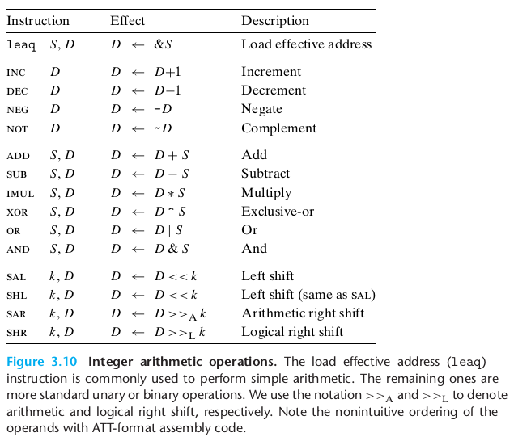

从[第一章](01_计算机系统漫游.md#2-程序被其他程序翻译成不同的格式)中，我们知道：编译器将预处理后的文本文件翻译成一个**包含汇编语言程序**的文本文件；然后再依次调用汇编器和链接器生成可执行的机器代码。本章中我们详细了解**汇编代码**。

高级语言编写的程序可以在很多不同的机器上编译和执行，但**汇编代码则是与特定机器密切相关的**。

本章基于机器语言：x86-64(另一种机器语言Intel-IA32在64位机器上运行的扩展)

# 2 程序编码
假设现有两个C程序文件：p1.c和p2.c。我们可以用UNIX命令行如下编译代码：
```shell
$ gcc -Og -o p p1.c p2.c
```
- ```gcc```指的是GCC C编译器，是Linux上默认的编译器，也可以简写为```cc```
- ```-Og```为编译选项，告诉编译器使用会生成符合原始C代码整体结构的机器代码优化等级。通常提高优化级别会使最终程序运行得更快，但编译时间可能会变长，用调试工具对代码进行调试会更困难。为避免优化代码严重变形，学习过程中我们使用```-Og```。实际中，从得到的程序性能方面考虑，```-O1```或```-O2```才是较好的选择。

gcc所采取的操作：
- **预处理**(插入#include的头文件，扩展#define的宏)
- **编译**(产生两个源代码的汇编代码p1.s, p2.s)
- **汇编**(将汇编代码转换成二进制目标代码p1.o, p2.o。目标代码包含所有指令的二进制表示，但是还没有填入地址的全局值)
- **链接**(将两个目标代码文件与实现库函数如printf的代码合并，并产生最终的可执行文件p)

## 2.1 机器级代码
两种对于机器级编程重要的抽象：
1. 指令集体系结构(Instruction set architecture, ISA):机器级程序的格式和行为，定义了处理器状态、指令的格式，以及每条指令对状态的影响。大多数ISA，包括x86-64，将程序的行为描述成每条指令是按顺序执行的(但实际是并发执行的)。
2. 虚拟地址：机器级程序使用的存储器地址，提供的存储器模型看上去是一个非常大的字节数组。

x86-64机器代码和原始的C代码差别特别大，一些C语言中不可见的处理器状态是可见的：
- 程序计数器(PC,x86-64中用```%rip```表示)，指示将要执行的下一条指令在存储器中为地址。
- 整数寄存器文件，包含16个命名的位置，分别存储64位的值。这些寄存器可用于存储地址或者整数数据。
- 条件码寄存器，保存最近执行的算术或逻辑指令的状态信息，用来实现控制或数据流中的条件年华，如if、while。
- 一组向量寄存器，用于存放一个或多个整数或浮点数据。

程序内存(program memory)包括程序的可执行机器代码、操作系统需要的一些信息，用来管理过程调用和返回的运行时栈，以及用户分配的内存块。**程序存储器用虚拟地址寻址**，但任意给定时刻，只有有限的一部分虚拟地址被认为是合法的，如64位地址的高16位必须设置为0。操作系统负责将虚拟地址翻译成实际处理器内存(processor memory)中的物理地址。

## 2.2 代码示例
- 比如我们写了一个C语言代码文件[mstore.c](src/03/mstore.c)。

	经过编译：
	```shell
	$ gcc -Og -S mstore.c
	```
	我们得到汇编文件[mstore.s](src/03/mstore.s)，其中包括各种声明及汇编代码。mstore.s的一部分如下：

	```
	multistore:
		pushq	%rbx
		movq	%rdx, %rbx
		call	mult2@PLT
		movq	%rax, (%rbx)
		popq	%rbx
		ret
	```

	或者直接编译+汇编：
	```shell
	$ gcc -Og -c mstore.c
	```
	得到二进制目标代码文件[mstore.o](src/03/mstore.o)。该文件无法直接打开，但是可以使用反汇编器(disassembler)查看二进制文件中的**字节序列**：
	```shell
	$ objdump -d mstore.o
	```
	也就是说机器实际执行的程序只是**对一系列指令进行编码的字节序列**，而对源代码一无所知。反汇编器的结果如下：

	```
	Disassembly of section .text:

	0000000000000000 <multistore>:
	0:   53                      push   %rbx
	1:   48 89 d3                mov    %rdx,%rbx
	4:   e8 00 00 00 00          callq  9 <multistore+0x9>
	9:   48 89 03                mov    %rax,(%rbx)
	c:   5b                      pop    %rbx
	d:   c3                      retq
	```

	注：
	1. x86-64指令长度从1到15个字节不等
	2. 每个字节可以唯一地解码成某条指令
	3. 反汇编器只基于机器代码文件(mstore.o)中的字节序列来确定汇编代码，不需要访问源代码(mstore.c)或汇编代码(mstore.s)
	4. 反汇编器使用的指令命名规则与GCC生成的汇编代码有细微差别，如省略了GCC中很多指令结尾的'q'。

- 而想要调用mstore.c中编写的函数，我们还需要编写一个调用该函数的主函数：[main.c](src/03/main.c)

	而想要生成可执行文件(命名为prog)，需要执行如下命令:
	```shell
	gcc -Og -o prog main.c mstore.c
	```
	我们也可以对可执行文件prog进行反汇编：
	```shell
	$ objdump -d prog
	```
	其中包含：
	```
	0000000000000741 <multistore>:
	741:   53                      push   %rbx
	742:   48 89 d3                mov    %rdx,%rbx
	745:   e8 ef ff ff ff          callq  739 <mult2>
	74a:   48 89 03                mov    %rax,(%rbx)
	74d:   5b                      pop    %rbx
	74e:   c3                      retq   
	74f:   90                      nop
	```

	反汇编得到的信息包含单纯对mstore.o反汇编得到的结果，但最左侧的Offset变成了真实的地址；另外callq那行汇编指令中的mult2函数的地址也变成了该函数可执行代码的地址```739```，而不再是```9```；最后一行的汇编指令```nop```为空语句，对程序没有影响。
- 直接从汇编代码获取机器代字节序列(详见[练习3.11](Exercises/03.md#3_11))
	1. 编写3_11.s文件
	2. 生成可执行文件：
		```shell
		$ as -o 3_11 3_11.s
		```
	3. 反汇编
		```shell
		$ objdump -d 3_11
		```

## 2.3 关于格式的注解
mstore.s的完整内容：
```
	.file	"mstore.c"
	.text
	.globl	multistore
	.type	multistore, @function
multistore:
.LFB0:
	.cfi_startproc
	pushq	%rbx
	.cfi_def_cfa_offset 16
	.cfi_offset 3, -16
	movq	%rdx, %rbx
	call	mult2@PLT
	movq	%rax, (%rbx)
	popq	%rbx
	.cfi_def_cfa_offset 8
	ret
	.cfi_endproc
.LFE0:
	.size	multistore, .-multistore
	.ident	"GCC: (Ubuntu 7.5.0-3ubuntu1~18.04) 7.5.0"
	.section	.note.GNU-stack,"",@progbits
```

我们尝试理解GCC产生的汇编代码(.s文件)：
- 所有以'.'开头的行都是指导汇编器和链接器的**伪指令**。我们通常可以忽略这些伪指令。
- C语言代码及对应汇编代码的具体解释：
    ```c
    long mult2(long, long);

    void multistore(long x, long y, long *dest) {
        long t = mult2(x, y);
        *dest = t;
    }
  ```

  

# 3 数据格式
Intel用术语**字(word)**表示16位数据类型，因此称32位数为**双字(double words)**，称64位数为**四字(quad words)**。注意这里的**字**与[计算机的字长](02_信息的表示和处理.md#1.2-字数据大小)不同，字长表示地址的标称大小。也就是说64位系统的地址长度为四字。

C语言数据类型在x86-64中的大小(1byte = 8bit):


- 指针实际包含的是地址，故如char*之类的指针是四字(8 byte)
- 大多数GCC生成的汇编代码指令都有一个字符后缀(Assembly-code suffix)，标明操作数的大小。例如数据传送指令的四个编钟：movb(传送字节)、movw(传送字)、movl(传送双字)和movq(传送四字)。但注意整数和浮点数使用的是不同的指令和寄存器：后缀'l'对于整数表示双字(32位)，而对于浮点数表示双精度(64位)。

# 4 访问信息
一个x86-64的中央处理单元(CPU)包含一组16个存储64位值的通用目的寄存器，用于存储整数数据和指针。下图展示各寄存器的名字及功能：


指令可以对这16个寄存器的低位字节中存放的不同大小的数据进行操作：字节级操作可以访问最低的字节，16位操作可以访问最低的2个字节，32位操作可以最低的4字节,64位操作可以访问整个寄存器。

注意一个惯例：在**寄存器**中生成**4字节(32位)**数字的指令会把该寄存器高4字节置为0。常见的如 存在```movl```而不存在```movzlq```,使用```movzbl```而非```movzbq```

## 4.1 操作数指示符
大多数指令有一个或多个操作数(operand)，指示出执行一个操作中要使用的源数据值以及放置结果的目的位置。源数据值可以以常数形式给出,或是从寄存器或内存中读出。结果可以存放在寄存器或内存中。因此,各种不同的操作数的可能性被分为三种类型：
- 立即数(immediate),用来表示常数值。在ATT格式的汇编代码中,立即数的书写方式是‘\$’后面跟一个用标准C表示法表示的整数,比如,```$-577``` 或 ```$0x1F```
- 寄存器(register),它表示某个寄存器的内容,16个寄存器的低位1字节(8位)、2字节(16位)、4字节(32位)或8字节(64位)中的一个作为操作数。下图中用$R[r_a]$表示寄存器a($r_a$)的值，即寄存器集合视作一个数组$R$，并用寄存器标识符作为索引
- 内存(Memory)引用，它会根据计算出来的地址(通常称为有效地址)访问某个内存位置。因为将内存看成一个很大的字节数组,我们用$M_b[Addr]$表示存储在内存中从地址$Addr$开始的$b$个字节值的引用，通常可省去下标$b$。


注：
- 除非以'\$'(立即数)或寄存器名字开头，否则均表示内存引用。
- 注意不能用寄存器的一部分(如\%ebx)作为地址，因为地址与寄存器都是64位
- Imm都是十进制，见[练习3.8](Exercises/03.md#3.8)
## 4.2 数据传送指令
最简单形式的数据传送指令：MOV类，将数据从源位置复制到目的位置，不作任何而变化。


注意：
- 传送指令的两个操作数不能都指向内存位置。将一个值从一个内存复制到另一个内存位置需要两条指令。
- 每个寄存器的后4字节、后2字节、后1字节都和整个寄存器一样有自己的名字，指令中寄存器部分名字的大小必须与指令最后一个字符(后缀)相匹配。
	```
	movabsq $0x0011223344556677, %rax   %rax为0011223344556677
	movb $-1, %al                      %rax为00112233445566FF
	movb $-1, %ax                      %rax为001122334455FFFF
	movb $-1, %eax                      %rax为00000000FFFFFFFF
	movb $-1, %rax                      %rax为FFFFFFFFFFFFFFFF
	```
	其中%al、%ax、%eax分别为寄存器%rax后1字节、后2字节、后4字节的部分的名字。

- MOV指令只会更新目的操作数指定的寄存器字节或内存位置。唯一的例外是```movl```指令以寄存器作为目的地时没回把该寄存器的高4字节(32位)设置为0。

除了最基本的MOV类，还存在MOVZ类(将较小的源值复制到较大的目的，剩余字节填充0)、MOVS类(将较小的源值复制到较大的目的，剩余字节填充源最高位)。此时的汇编后缀由两位组成，分别表示源和目的的大小：


注：
- MOVZ类不存在把双字零扩展到四字的```movzlq```，因为生成4字节值并以寄存器为目的的指令```movl```会自动把高32位置为0,等价于所谓的```movzlq```。
- 对于寄存器而言，64位的零扩展(如```movzbq```)一般被32位的零扩展取代(如```movzbl```)
- ```cltq```没有操作数，总以寄存器```%eax```为源，```%rax```为符号扩展结果的目的，与```movslq %eax %rax```一致。
- 用MOVZ类(零扩展)还是MOVS类(符号扩展)仅仅取决于源操作数类型，见[扩展一个数字的位表示](02_信息的表示和处理.md#2.6-扩展一个数字的位表示)
- 在源操作数长度大于目的操作数时一般先将整个源操作数复制过来，再直接移动所需的目的操作数长度。

更多详见[练习3.4](Exercises/03.md#3.4))

## 4.3 数据传送示例
对于[exchange函数](src/03/exchange.c)：
```cpp
long exchange(long *xp, long y) {
    long x = *xp; //movq	(%rdi), %rax
    *xp = y;      //movq	%rsi, (%rdi)
    return x;	  //ret
}
```
其汇编代码部分如下:
```
exchange:
	movq	(%rdi), %rax
	movq	%rsi, (%rdi)
	ret
```
过程开始执行时，xp和y分别存储在寄存器%rdi和%rsi中。所有C代码与汇编代码的对应关系见C代码的注释。

像x这样的局部变量筒仓保存在寄存器中(如%rax)而不是内存中。访问寄存器比访问内存要快得多。

## 4.4 压入和弹出栈数据
也可以将数据压入程序栈中或从程序栈中弹出数据。在x86-64中，程序栈存放在内存中某个区域，且通常**栈顶元素的地址是所有栈中元素地址中最低的**，栈指针%rsp保存这栈顶元素的指针。


注意[每个地址都有唯一与之对应的字节空间](02_信息的表示和处理.md#1-信息存储)。因此当我们压入/弹出一个四字(8字节)时，我们必须首先将栈指针减/加8。

# 5 算术和逻辑操作
下表中列出了x86-64的一些整数和逻辑操作。表中除了leaq外的其他指令都只是指令类名(类似MOV)，而非指令名(如movl)。每个指令类都可以扩展出b, w, l, q四种类型：



注：complement指取补

## 5.1 加载有效地址 load effective address
```leaq S,D```可以将S的地址写入D中。目的操作数D必须是寄存器。

一些灵活用法：
假设%rdx的值为x，那么指令```leaq 7(%rdx,%rdx,4),%rax```表示将设置寄存器%rax的值为5x+7


## 5.2 一元和二元操作
INC(递增)、DEC(递减)、NEG(取负)、NOT(取补)类是一元操作，操作数既是源也是目的。该操作数可以使寄存器也可以是内存位置。

ADD、SUB、IMUL、XOR、OR、AND是二元操作，第二个操作数既是源也是目的：```subq %rax,%rdx```表示从%rdx中减去%rax

## 5.3 移位操作
SAL、SHL(均是左移)、SAR(算术右移)、SHR(逻辑右移)先给出移位量，然后第二位给出的是要移位的寄存器或内存。移位量可以是一个立即数也可以是放在单字节寄存器%cl中(这些指令只允许以这个特定的寄存器作为操作数)。因此一个字节的移位量是的移位量的编码范围达到255。

x86-64中，移位只考虑%cl的低w位，其中汇编指令的后缀决定了m(可以认定m为后缀对应字节数)，且满足$w=2^m$。如寄存器%cl的十六进制值为0xFF，则指令salb会移动7位($2^0+2^1+2^2$)，salw指令会移动15位($2^0+...+2^4$)，sall会移31位，salq会移63位。立即数作操作数时可以直接用q做后缀，但立即数必须加```$```符号表示这是一个立即数。

注：如果想要将某寄存器中值与一个较大常数相乘，经常联用leaq和salq。如想与48相乘，可以先左移4位，然后用leaq乘3。

## 5.5 特殊的算术操作
我们知道两个64位操作数相乘需要128位来表示。x86-64指令集对128位(八字oct word，16字节)提供有限的支持。


[双操作数的imulq指令](#5-算术和逻辑操作)从两个64位操作数产生一个64位乘积，实现[有符号乘法](02_信息的表示和处理.md#3.5-补码乘法)。

但单操作数的imulq指令要求一个参数必须在寄存器%rax中，而另一个操作数作为指令的源操作数给出。最终生成的128位乘积分别存放在寄存器%rdx(高64位)和%rax(低64位)。

# 6 控制
下面我们考虑如条件语句、循环语句和分支语句等不是直线代码的行为：jump指令可以改变一组机器代码指令的执行顺序。
## 6.1 条件码 condition code
除了整数寄存器，CPU还维护着一组单个位的条件码寄存器，它们描述了最近的算术或逻辑操作的属性，可以检测这些寄存器来执行条件分枝指令。常用条件码如下：
- CF：Carry flag 进位标志，表示最近的操作产生了无符号操作的溢出
- ZF：Zero flag 零标志，最近操作得出的结果是0
- SF: Sign flag 符号标志，最近操作得到的结果为负数
- OF: Oveflow flag 溢出标志，最近操作导致了补码溢出

下图中除了leaq不会改变条件码外(因为leaq用地址计算)，其他所有指令都会设置条件码。


- 其中逻辑计算(如XOR)会将CF和OF设置为0
- 移位操作的CF设置为最后一个被移出的位，OF设置为0
- INC和DEC会设置OF和ZF，但不改变CF

CMP类和TEST类会设置条件码，但是不改变任何其他寄存器，分别相当于 只设置条件码，不改变任何寄存器版本的 SUB类和AND类。


## 6.2 访问条件码
条件码通常不会直接读取，常用使用方法如下：
1. 根据条件码的某种组合，将一个字节设置为0或1，如SET类指令(注意SET类指令的后缀不表示操作数大小，其目的操作数是低位**单字节**寄存器或是**一个字节**的内存位置)：
   
   

   注：Synonym和第一列可以互换，set condition指的是**在进行两个操作数的比较(CMP)后，被set的低位寄存器在满足set condition时被set为1，反之set为0**。

	下面的代码返回 ```a < b```的结果(其中a在%rdi， b在%rsi)
   ```
	comp:
		cmpq %rsi, %rdi  根据a-b调整条件码，但注意参数顺序是b， a
		setl %al         将%al设置为SF^OF,即有符号小于
		movzbl %al, %eax 自动清空高32位
		ret
	```
	其实所有的条件问题都可以转化成两个数的比较(或TEST，见[练习3.14](Exercises/03.md#3.14))，比如```if(a)```可以转换为```if(a != 0)```。因此通用办法就是利用CMP指令(后缀取决于操作数大小)比较两个操作数(注意颠倒顺序)，然后根据所需选择set condition，设置某个寄存器。
2. 可以条件跳转到程序的某个其他部分，见[用条件控制来实现条件分枝](#65-用条件控制来实现条件分枝)
3. 可以有条件地传送数据

## 6.3 跳转指令
- **直接**跳转的目的地需要一个label，如下面的```.L1```:
	```
		movq $0, %rax
		jmp .L1
		movq (%rax), %rdx   被跳过
	.L1:
		popq %rdx
	```
- **间接**跳转的跳转目标(可以借此得出下一条指令的地址)从寄存器或内存位置中读出：
	```
	jmp *%rax   将寄存器中的值作为跳转目标
	jmp *(%rax) 将寄存器中的值作为地址，将该地址在内存中对应的值作为跳转目标
	```

更多见下表(满足跳转条件时跳转，1表示无条件跳转)：


## 6.4 跳转指令的编码
跳转指令有几种不同的编码，但是最常用的是PC-relative，即将目标指令的地址与**紧跟在跳转指令后面那条指令**的地址之间的差作为编码。也存在绝对编码，即直接指定目标指令地址。


上例反汇编版本(disassembled version)中左侧字节序列(汇编器)采用的是PC-relative， 而反汇编出的汇编指令采用的就是绝对编码。

第2行中字节序列中的```03```表示跳转目标的地址是 ```0x5 + 0x03 = 0x8```即L2对应的第4行指令地址。第5行中字节序列的```f8```(十进制-8)表示跳转目标的地址是 ```0xd + 0xf8 = 13 - 8 = 0x5```即L3对应的第3行指令地址。

通常来说，PC-relative的指令编码简洁且可迁移性高。

## 6.5 用条件控制来实现条件分枝
将条件表达式和语句从C语言翻译成机器代码，最常用的方式是结合有条件和无条件跳转。

下图显示了C语言代码、C语言的goto版本和汇编的比较：


对于C语言中的条件语句
```cpp
if (test-expr) {
	then-statement
}
else {
	else-statement
}
```
而汇编语言一般如此处理：
```cpp
	t = text-expr;
	if (!t) {
		goto false;//条件跳转
	}
	then-statement
	goto done;//无条件跳转
false:
	else-statement
done:
	return;
```

## 6.6 用条件传送类实现条件分枝